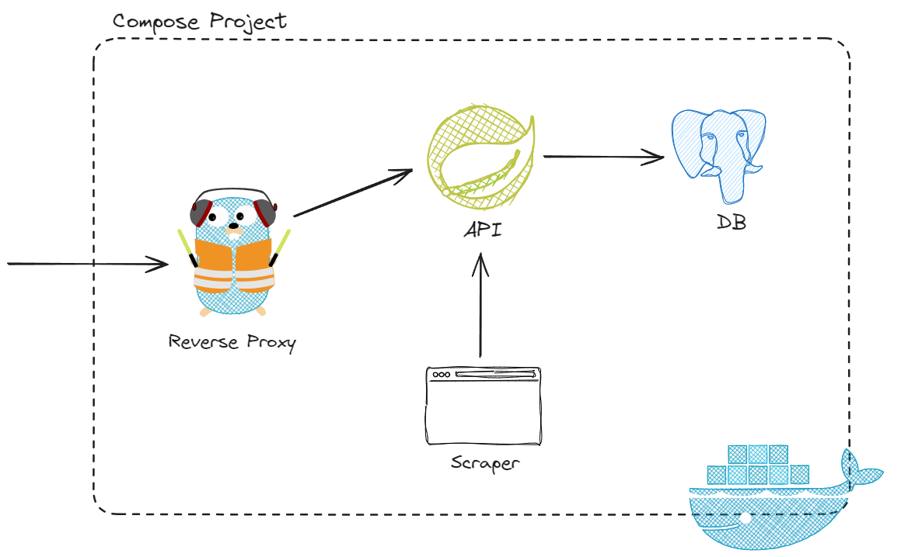

# formula-ap1

> **The API is not ready for production yet.**  
> Due to university stuff I won't have time to contribute to the project for a few months 😢

formula-ap1 is a REST API that provides data about the formula one racing series.

<!-- formula-ap1 provides F1 data via a REST API.

F1 REST API -->

<!-- > The api is still in development and not ready for production yet. Breaking changes are to be expected.

> The api is still in early stages and not ready for production yet.

> The api is still at an early stage and is not yet ready for production.

> The api is in an early stage and there is a lot to do to before it is ready for production.

> The api is in an early stage and not ready for production yet. -->

## Why does this exist?

The project started with the idea to build an open source F1 betting game.
While looking for services which could provide race data, I came across the free and handy
[Ergast API](https://ergast.com/mrd/).
Unfortunately, it does not provide all data needed, such as top speeds data.
In addition to that, it looks like the API will be shut down at the end of 2024.
Therefore, I made the decision to collect the data myself via a web scraper and make it accessible via a REST API.

<!-- Therefore, the decision was made to collect the data ourselves via a web scraper and make it accessible via a REST API.
So that is the main reason why this api exists. -->

<!-- Unfortunately it did not provide all data needed as for example there are no top speeds data. -->

## Usage

You will find the OpenAPI documentation at [formula-ap1.com](http://formula-ap1.com/).  
**Notice:** If you want to try out the API via Swagger UI, make sure to not load the page over HTTPS, as
the API is served over HTTP, which leads to a
[mixed content](https://developer.mozilla.org/en-US/docs/Web/Security/Mixed_content) error.
Just use HTTP and everything will work.

## How is it built?

<!-- The API is built in Java with Spring Boot. PostgreSQL is used as database

The API is built in Java with Spring Boot and PostgreSQL. More information about it can
Further documentation about it can be found in this README.
The data of the API is scraped by a web scraper that is built with TypeScript and NodeJs

The data is scraped by a web scraper that is built with TypeScript and NodeJs.

The API is built in Java with Spring Boot and PostgreSQL. Gradle is used as the build tool.
The data of the API is scraped by a web scraper that is built with TypeScript and NodeJs. It uses the
[Crawlee library](https://crawlee.dev/) for the scraping and the [got library](https://github.com/sindresorhus/got)
to pass the scraped data to the API. -->

The API is built in Java with [Spring Boot](https://spring.io/projects/spring-boot) and
[PostgreSQL](https://www.postgresql.org/). A web scraper, built with [TypeScript](https://www.typescriptlang.org/) and
[NodeJs](https://nodejs.org/), is used to scrape the data with the [Crawlee library](https://crawlee.dev/) and send
it to the API by using the HTTP request library [got](https://github.com/sindresorhus/got).
[Ansible](https://www.ansible.com/) is used to set up
an Ubuntu server and deploy the API and the scraper via [Docker Compose](https://docs.docker.com/compose/).
To secure the API, traffic is routed through the reverse proxy [Traefik](https://traefik.io/traefik/):

<!-- Ansible is used to set up an Ubuntu server and deploy
the API and the scraper with Traefik via Docker Compose: -->

Further documentation of each project can be found in the `README` in the project directory.

<!-- Documentation of each project can be found in the `README` in the project directory.

Each project is documented in the `README` in the project directory. -->

## Docker

The API and the scraper image for `linux/amd64` and `linux/arm64` are available on
[DockerHub](https://hub.docker.com/repository/docker/marcheiden/formula-ap1).

<!-- More information about each image is provided in the `Docker` section of the `README`
in the corresponding project directory. -->

### Image Tags

#### `formula-ap1:api-<version>`

This is the image of the API. More information about it can be found [here](./api/README.md#docker).

#### `formula-ap1:scraper-<version>`

This is the image of the scraper. More information about it can be found [here](./scraper/README.md#docker).

## EditorConfig

[EditorConfig](https://editorconfig.org/) is used to define basic format styles.
The [`Editorconfig check`](./.github/workflows/editorconfig-check.yml) workflow checks whether all files comply with
the styles defined in [`.editorconfig`](./.editorconfig) when a pull request against `main` is created.

<!-- Whenever a pull request against main is created, the `Editorconfig check` workflow checks
whether all files comply with the styles defined in [`.editorconfig`](./.editorconfig). -->

<!-- ## Contribute

Feel free to open issues / feature requests -->
