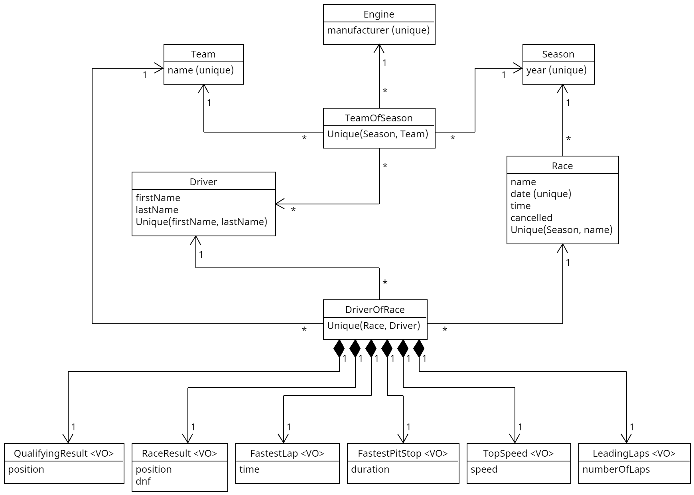

# API

The API is built in Java with Spring Boot and PostgreSQL. Gradle is used as the build tool.

<!--The API is built in Java with [Spring Boot](https://spring.io/projects/spring-boot).
[Postgres SQL](https://www.postgresql.org/) serves as underlying database and Gradle is used as the build tool.-->

## API Documentation

The API endpoints are documented with the OpenAPI Specification 3.0.
To avoid dealing with a single large file, the
parameter, response and schema components are documented in seperated files.
During the deployment of the documentation to GitHub Pages the files are then bundled into a Swagger UI compliant file
(see [Bundle and deploy OpenAPI to GitHub Pages workflow](../.github/workflows/bundle-and-deploy-openapi.yml)).
Thanks to a feature of the [Redocly CLI](https://github.com/Redocly/redocly-cli),
which is used for linting and bundling the documentation, a public and an internal documentation
can be generated, as paths for the public documentation can be excluded if `x-internal` is set to true.

### Lint OpenAPI Documentation

In order to lint the OpenAPI documentation locally, as done remote by the
[Lint OpenAPI workflow](../.github/workflows/lint-openapi.yml), install the Redocly CLI globally via npm:

```shell
> npm install @redocly/cli@"^1.0.2" -g
```

and run:

```shell
> redocly lint api-internal --config ./api/openapi/redocly-cli-config.yml
```

<!--This way it is also possible to generate an internal API documentation and

This way it is also possible to generate a
This way it is also possible to generate a public documentation where only GET Requests are allowed and an internal documen

For the deployment of the specification with Swagger UI to GitHub Pages the workflow `Bundle and deploy OpenAPI to GitHub Pages`
is uses.
To deploy the documentation with Swagger UI to GitHub Pages the workflow

To deploy the documentation with Swagger UI and GitHub Pages
In order to provide the documentation via GitHub Pages the files are bundled in the `Bundle and deploy OpenAPI to GitHub Pages`
workflow
and bundled into a Swagger UI compliant file
using the [Redocly CLI](https://github.com/Redocly/redocly-cli)

As not everyone should be able to create, update or delete data, `x-internal` is set to true for all non-GET endpoints.
This way, the endpoints can be excluded when all files are bundled into a Swagger UI compliant file using the
[Redocly CLI](https://github.com/Redocly/redocly-cli).-->

## Domain Model

The following model represents the domain layer:

<!--The following model represents the domain layer implemented with
[Spring Data JPA](https://spring.io/projects/spring-data-jpa):-->



VO stands for Value Object, which leads to an implementation as Embeddable in Spring.

## Package Structure

Every entity from the domain model has its own package, which is dived into a domain and an application package.
The first contains the entity and repository while the latter is used for the application logic.
The Controller, Application Service and DTO can be found here.

## DTOs

To encapsulate domain objects only DTOs are passed to the outside.

### Mapping

The mapping between the domain object and the DTOs is implemented with the [MapStruct](https://mapstruct.org/)
Mapping Framework in a corresponding `Mapper` class in the application package.

<!--The Mapping between the domain object and DTOs is realized with the
[MapStruct](https://mapstruct.org/) Mapping Framework. This resolves in
a Mapper class in the application package for each entity.-->

### Validation

DTOs passed with a request are validated with
[Spring's Bean Validation](https://docs.spring.io/spring-framework/reference/core/validation/beanvalidation.html).
Since the validation constraints are not always the same for create and update operations, the validation groups
[`OnCreate`](./src/main/java/api/validation/OnCreate.java) and
[`OnUpdate`](./src/main/java/api/validation/OnUpdate.java) are used to
specify when a constraint should apply, such as in the
[`DriverInfoDTO`](./src/main/java/api/driverofrace/application/DriverInfoDTO.java).

More information about validation with spring can be found in
[this](https://reflectoring.io/bean-validation-with-spring-boot/) blog post.

## Exception Handling

Every exception that is thrown is caught by the
[`ApiExceptionHandler`](./src/main/java/api/exception/ApiExceptionHandler.java)
, which creates and returns a corresponding
[`ApiExceptionInfo`](./src/main/java/api/exception/ApiExceptionHandler.java)
from the caught exception.

[`ApiException`](./src/main/java/api/exception/ApiException.java)
acts as abstract base exception that is extended by all project specific
exceptions.

## Query Parameters / Paging and Sorting

Paging is used to reduce network traffic if only a chunk of data is needed.

<!-- The paging and sorting parameters described in the API documentation are bundled in a Pageable object, which is
therefore a parameter in all controller methods that return a collection. Another parameter that these controller
methods have is the `parameters` parameter, which is an instance of
`MultiValueMap<String, String>` and which stores all given query parameters that are then validated
(see [Query Parameters](#query-parameters)). -->

<!-- ### Sort Properties -->

### Sort Property Handling

<!-- #### SortPropertyMapper -->

The sort query parameter can be used to sort entities by their properties. If the sort property does not exist in the
entity a `PropertyReferenceException` is thrown. Therefore, properties that are named differently in the entity and the
corresponding DTO must be mapped to each other. <br>
The mapping logic is implemented in the
[`SortPropertyMapper`](./src/main/java/api/queryparameter/sort/SortPropertyMapper.java) interface.
It defines a `getSortProperties` and a `map` function. <br> The first returns a map of the related sort properties,
where the keys are the property names in the DTO and the values are the corresponding property names in the entity.
The concrete map is defined in the `SortPropertyMapper` implementation for the corresponding entity
(see e.g. [`SeasonSortPropertyMapper`](./src/main/java/api/season/application/SeasonSortPropertyMapper.java)). <br>
The latter uses the map to create a valid `Sort` object: For each sort property of the given `Sort` object is checked
whether it is a key in the `sortProperties` map.
If this is the case, the sort property is replaced by the corresponding property name of the entity.
If not it is assumed that the property has the same name in the entity and the DTO, and it is checked whether
the sort property is contained in the `properties` list
(cf. e.g [`SeasonDTO`](./src/main/java/api/season/application/SeasonDTO.java)) of the DTO.
If true, the property is left as it is. Otherwise, an
[`ApiInvalidSortPropertyException`](./src/main/java/api/exception/ApiInvalidSortPropertyException.java) is thrown.

<!-- #### SortPropertyHandler -->

Since the `Sort` object is encapsulated inside a `Pageable` object, the `map` function is called
from the `handleSortProperties` functions of the
[`SortPropertyHandler`](./src/main/java/api/queryparameter/sort/SortPropertyHandler.java) which then create a new
`Pageable` instance that can be passed to repository methods.

<!-- ### Query Parameters -->

### Query Parameter Validation

Spring ignores invalid query parameters by default. For example the following GET Request
`/seasons?foo=bar` would be interpreted as GET `/seasons`. As this behaviour is not intuitive, the
`checkIfParametersAreValid` method of the
[`QueryParameter`](./src/main/java/api/queryparameter/QueryParameter.java) interface checks if given query parameters
are contained in the `queryParameters` set defined for the corresponding entity and, if not,
throws an [`ApiInvalidQueryParameterException`](./src/main/java/api/exception/ApiInvalidQueryParameterException.java).

<!-- ### Handling Query Parameters and Sort Properties -->

### Combination of Sort Property Handling and Query Parameter Validation

To check given query parameters and sort properties together the `handleQueryParameters` functions of the
[`QueryParameterHandler`](./src/main/java/api/queryparameter/QueryParameterHandler.java) are used.

<!-- To check given query parameters and sort properties together the handleQueryParameters functions of the
QueryParameterHandler call the appropriate function.

As specified query parameters that do not exist are ignored by default

As specifying query parameters that does not exist like the following example
GET `/seasons?foo=bar` are ignored by default and


The QueryParameter interface provides a getQueryParameters and checkIfParametersAreValid method.

Invalid query parameters are ignored by default. -->

<!--ince the `Sort` object is encapsulated inside a `Pageable` object the purpose of the
`handleSortProperties` functions of the
[`SortPropertyHandler`](./src/main/java/api/queryparameter/sort/SortPropertyHandler.java)
is to call the map function of the given
[`SortPropertyMapper`](./src/main/java/api/queryparameter/sort/SortPropertyMapper.java)
and return a new `Pageable` instance.-->

<!--Since the `Sort` object is encapsulated inside a `Pageable` object the provided
handleSortProperties functions by the SortPropertyHandler are used to invoke the map function of the given
SortPropertyMapper and return a new Pageable instance.

Since the `Sort` object is encapsulated inside a `Pageable` object the SortPropertyHandler
provides handleSortProperties methods which invoke the map function of the given
SortPropertyMapper and return a new Pageable instance.

Since the `Sort` object is encapsulated inside a `Pageable` object the handleSortProperties fu

Since the `Sort` object is encapsulated inside a `Pageable` object the handleSortProperties functions
invoke the map function and return a new Pageable instance.

are used
to invoke the map function and

Since the `Sort` object is encapsulated inside a `Pageable` object the handleSortProperties function takes in a Pageable
object, calls the map

Since the `Sort` object is encapsulated inside a `Pageable` object a handleSortProperties function is used
to also create

Since the `Sort` object is encapsulated inside a `Pageable` object when creating a new Sort object also a new Pageable
object neede to be created.

Since the sort properties, defined in a Sort object are encapsulated inside a Pageable object, creating a new
Sort object w

the Pageable object
also needs to be updated

Since the sort properties, defined in a Sort object are encapsulated inside a Pageable object the handleSortProperties
functions defined in the SortPropertyHandler are used to-->

<!--The latter implements the mapping logic and returns a new sort object.

It is checked for each given sort property in the sort object whether it is a key in the `sortProperties` map.-->

<!--If so and if the property is not an id (there is no purpose of sorting objects after an uuid) the sort
property is leaved as it is.

It defines a getSortProperties function which returns a map of the related sort properties, where the key is
the property name in the DTO and the value is the corresponding property name in the entity.

This is the task of the SortPropertyMapper interface.

The related property names are defined in a sortProperties map in
the SortPropertyMapper implementation for the corresponding entity.

This is a problem if a property name in the entity and the
corresponding DTO does not match. As only properties of the DTO are allowed as sort properties, different
property names must be mapped together. This is done by the map method of the SortPropertyMapper interface.
It checks for each given sort property if it is a key in the sortProperties map which is implemented in the SortPropertyMapper
of the corresponding entity (see e.g. SeasonSortPropertyMapper). If so, the sort property replaced by the corresponding
property name of the entity specified as the value in the sortProperties map. If not it is assumed that the property
has the same name in both entity and DTO, and it is checked if the sort property is contained in the properties list
of the DTO. If so and if the property is not an id (there is no purpose of sorting objects after an uuid) the sort
property is leaved as it is. Otherwise, an ApiInvalidSortPropertyException is thrown.

It checks if the given sort properties are keys in the sortProperties Map which is implemented in the SortPropertyMapper
of the corresponding entity (see e.g. SeasonSortPropertyMapper).

It checks if the given sort properties are not ids (no purpose of sorting after ids) are keys in the sortProperties Map which is implemented in the SortPropertyMapper
of the corresponding entity (see e.g. SeasonSortPropertyMapper).

The mapping logic is implemented in the SortPropertyMapper interface which

This is done by the SortPropertyMapper which

But as the properties in an entity and the corresponding DTO do not always have the same name

Through the sort query parameter entities can be sorted

Since sorting is based on entities property names, the property names of the entity and the DTO must match.

a PropertyReferenceException would raise if one would try

As the properties in an entity and the corresponding DTO do not always have the same name, the different property names
need to be mapped, so that sorting works.

As the properties in an entity and the corresponding DTO do not always have the same name, the different property names
need to be mapped, so that sorting works.

As the properties are not always named the same in an entity and the corresponding DTO

Since the property names in the DTO do not always match the property name in the corresponding entity-->

### `ResponsePage`

Instead of passing the complete page object as response body, only
the properties `totalElements`, `totalPages`, `pageNumber`, `pageSize`
and `content` of the page are returned as an instance of
[`ResponsePage`](./src/main/java/api/responsepage/ResponsePage.java).

<!--Instead of passing an instance of Spring's Page class as response body, the lighter
ResponsePage is returned.-->

<!--Instead of passing the complete page object as response body, only
the properties `totalElements`, `totalPages`, `pageNumber`, `pageSize`
and `content` of the page are returned in form of an ResponsePage.

Instead of passing an instance of Spring's Page class as response body the more lightweight
ResponsePage is used.-->

For more general information about Paging with Spring, take a look at these blog posts on
[Reflectoring](https://reflectoring.io/spring-boot-paging/) and
[HowToDoInJava](https://howtodoinjava.com/spring-data/pagination-sorting-example/).

## Environment Variables

### `SPRING_PROFILES_ACTIVE`

Specifies the Spring Profile. Available options are `prod` and `dev`.
Depending on which profile is used, the configurations defined in
[`application-prod.yml`](./src/main/resources/application-prod.yml) or
[`application-dev.yml`](./src/main/resources/application-dev.yml) are used.

If set to `dev`, starting the application will also start the postgres service specified
in the [`compose-dev.yml`](./compose-dev.yml) via the
[Spring Docker Compose Support](https://spring.io/blog/2023/06/21/docker-compose-support-in-spring-boot-3-1).

### `DEFAULT_PAGE_SIZE`

Specifies the default `pageSize` used for paging of collections.

**Default value:** 25

### `MAX_PAGE_SIZE`

Specifies the maximum allowed `pageSize`.

**Default value:** 100

### `prod` specific Environment Variables

#### `DB_URL`

Specifies the PostgreSQL URL.

**Default value:** //postgres:5432/postgres

#### `DB_USERNAME`

#### `DB_PASSWORD`

Specifies the password for the specified `DB_USERNAME`.

## Docker

The [`Dockerfile`](./Dockerfile) used to build the image of the API available on
[DockerHub](https://hub.docker.com/repository/docker/marcheiden/formula-ap1) is based on suggestions of
[this](https://spring.io/guides/topicals/spring-boot-docker/) Spring Guide. It makes use of
[Multi-stage builds](https://docs.docker.com/build/building/multi-stage/) and JAR layers to
speed up subsequent builds. The Alpine version of the
[Eclipse Temurin JRE image](https://hub.docker.com/_/eclipse-temurin) is used as base image.

<!-- The image is based on the Alpine version of the
[Eclipse Temurin JRE image](https://hub.docker.com/_/eclipse-temurin). -->

<!-- The [`Dockerfile`](./Dockerfile) used to build the image of the API available on
[DockerHub](https://hub.docker.com/repository/docker/marcheiden/formula-ap1)
makes use of [Multi-stage builds](https://docs.docker.com/build/building/multi-stage/) and JAR layers to
speed up subsequent builds. For information about containerizing a Spring Boot application take a look
at [this](https://spring.io/guides/topicals/spring-boot-docker/) Spring Guide.

The [`Dockerfile`](./Dockerfile) used to build the image of the API available on
[DockerHub](https://hub.docker.com/repository/docker/marcheiden/formula-ap1) is highly inspired by
[this](https://spring.io/guides/topicals/spring-boot-docker/) Spring Guide. It makes use of
[Multi-stage builds](https://docs.docker.com/build/building/multi-stage/) and JAR layers to
speed up subsequent builds.

The [`Dockerfile`](./Dockerfile) used to build the image of the API available on
[DockerHub](https://hub.docker.com/repository/docker/marcheiden/formula-ap1) is based on suggestion of
[this](https://spring.io/guides/topicals/spring-boot-docker/) Spring Guide. It makes use of
[Multi-stage builds](https://docs.docker.com/build/building/multi-stage/) and JAR layers to
speed up subsequent builds. -->

### Build Image

To build a container image from the Dockerfile run:

```shell
> docker build -t <imageName>:<imageTag> --pull [--no-cache] .
```

### Environment Variables

See [Environment Variables](#environment-variables).

**Notice:** Set `SPRING_PROFILES_ACTIVE` to `prod` as `dev` is meant to be used during local development only
and does not work when running the application via Docker with the provided image.

<!-- **Notice:** Set `SPRING_PROFILES_ACTIVE` to `prod` as `dev` is meant to be used during local development only
and does not work when running the application in a container. -->

## Formatting

<!-- This project uses the spotless gradle plugin -->

This project uses the [palantir-java-format](https://github.com/palantir/palantir-java-format). To format files
accordingly, execute:

```shell
> ./gradlew spotlessJavaApply
```

To check whether all files comply with the format, as done by the
[Spotless check workflow](../.github/workflows/spotless-check.yml), run:

```shell
> ./gradlew spotlessJavaCheck
```

<!-- This is also done by the [Spotless check workflow](../.github/workflows/spotless-check.yml) whenever a pull request
is created. -->
